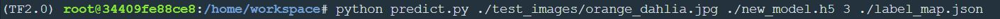
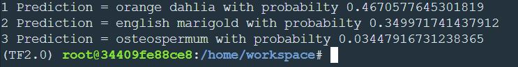

# Image_classification_oxford402_tensorflow_keras

Image classification on  oxford402 (part of tensorflow datasets) as a part of Udacity Nano Degree Program

# Sample scipt input : 

# Input image 

# Sample result : 

